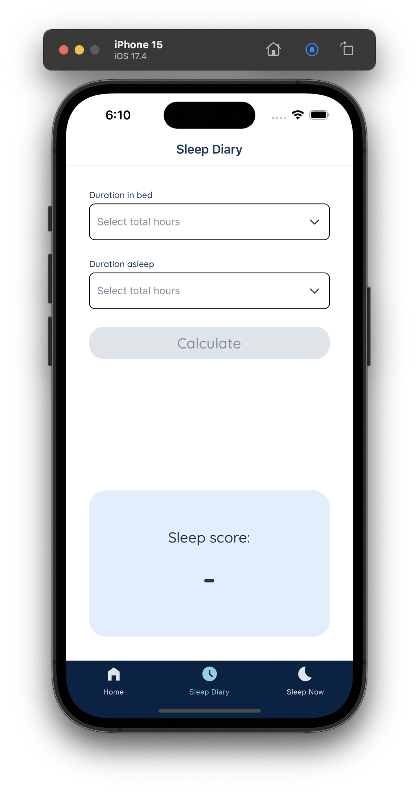
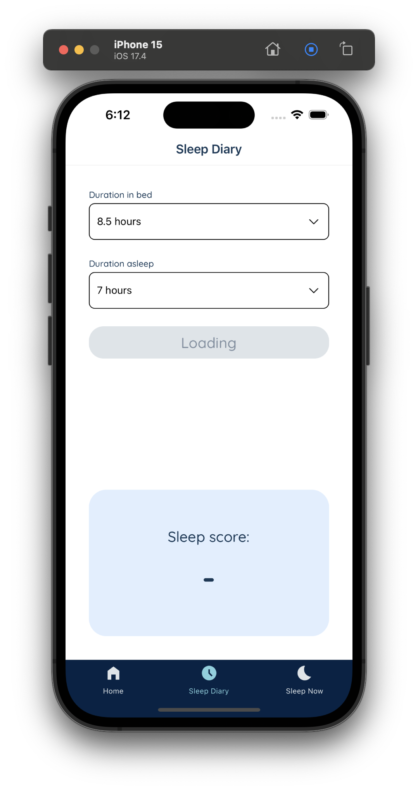
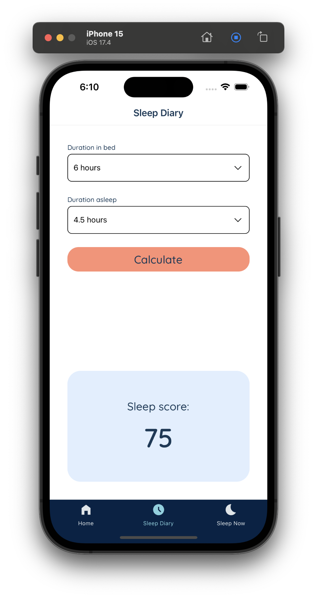
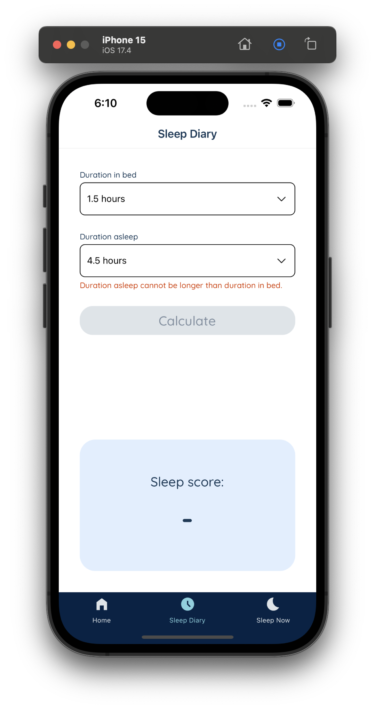
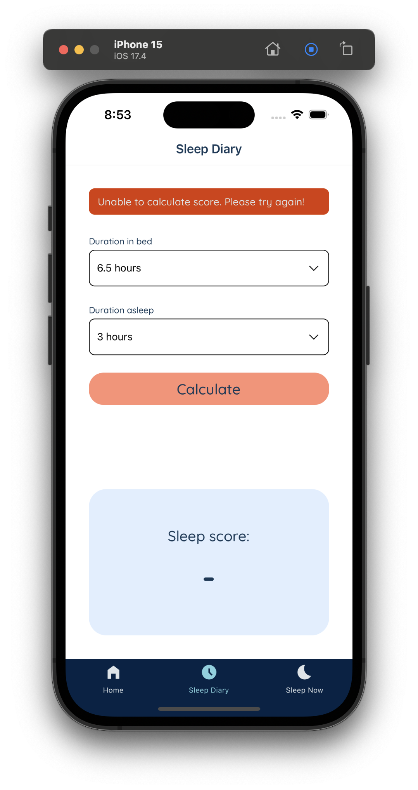

# Hello! 👋🏽

## Disclaimer

Admittedly I _technically_ spent more than 4 hours on this, but that was due to:
- I was using Expo Router for the first time (which was neat)
- Config issues with jest--and some shenanigans surrounding `babel`, `jest-expo` vs `react-native` preset
- Spending too long fighting types for the UI library I first chose
- Side quests related to the tools I was using that I opted into, just to try things out

---

## Some Notes

- This is a simple React Native app rather than something browser based, since I know the role leans more towards that
- _On framework choice:_ I'm familiar with Expo, but never had the chance to use the new ✨ Expo Router ✨ for an app, so I figured I'd give it a try
- _On library choice:_ Started off trying to use a full on UI library like tamagui/react native elements, but decided after some fiddling and finding myself spending too much time tweaking config files that it was overkill...
    - ...and went instead with a library specifically for a dropdown that is maintained
    - First choice was [`react-native-element-dropdown`](https://github.com/hoaphantn7604/react-native-element-dropdown), but then found myself fighting the types. To achieve my goal I'd have to patch or fork the repo, so instead...
    - ...I went with [react-native-dropdown-picker](https://hossein-zare.github.io/react-native-dropdown-picker-website/), which was simple enough when I did basic tests
    - Partway through I thought about switching back to tamagui because of the lack of flexibility--but it didn't make sense to start over

- _On mock api:_ I chose postman because I'm most familiar with it, required the least set up on my end, and it's very easy to quickly add/update new mock endpoints as needed
- _On UI choices:_ I set up the bottom tabs mainly as a way to learn Expo Router's paradigms--and then decided to keep and style them since they made the app feel "nicer." Also, the colors were taken from app store screenshots.

---

## Running the app

- Download Expo Go OR open simulator/emulator
- Install dependencies
   ```bash
   npm install
   ```
- Start the app:
   ```bash
    npx expo start
   ```
- Running tests:
   ```bash
    npm run test
   ```

## Tools & Libraries

#### Frameworks:
- React Native/Typescript
- [Expo](https://reactnative.dev/docs/environment-setup#start-a-new-react-native-project-with-expo); created with [`create-expo-app`](https://www.npmjs.com/package/create-expo-app)
- [Expo Router](https://docs.expo.dev/router/introduction/)
- [Expo Go](https://expo.dev/go) for testing the app

**UI:**
- [react-native-dropdown-picker](https://hossein-zare.github.io/react-native-dropdown-picker-website/)

**UX + API:**
- [React Hook Form](https://react-hook-form.com/) for gathering values to "save"
- [Zod](https://zod.dev/) for form validation
- [postman](https://learning.postman.com/docs/designing-and-developing-your-api/mocking-data/setting-up-mock/) to set up a (public) mock server to which we can send API calls
- [Fetch API](https://reactnative.dev/docs/network) for requests

**Testing:**
- [jest](https://jestjs.io/docs/tutorial-react-native)
- [@testing-library/react-native](https://testing-library.com/docs/react-native-testing-library/setup)

---

## Screenshots/Previews
<div style={{ display: 'flex', flexWrap: 'wrap' }}>
    
    
    
    
    
</div>

## Future Thoughts

If I were to spend more time, I would also want...

- Better UX details 
    - Show user feedback in the UI for _error_, success, _or_ other states using a snackbar/toast
    - Smoother interactions/animations (e.g. selecting the dropdown, animated loading)
- Refined API details
    - Environment variables for URL, etc
    - Making it a private endpoint, thus requiring an API Key
- More tests
    - Particularly on the actual input selection flow
    - Optimizing test suite run time
    - Maybe a different folder structure for the tests
- More explicit documentation around props, etc if this dropdown was a component in a larger code base
- Making sure it works on "web," since you can technically do that with Expo
- DRY(er) modules, for repetitions in tests or component
- ...?

---
